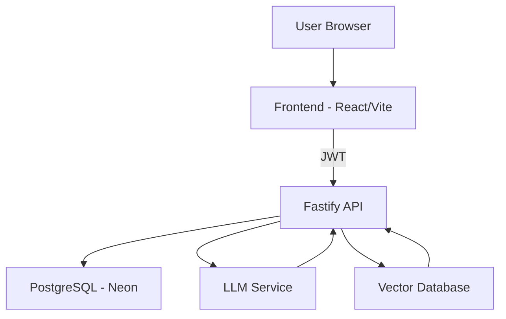

# DreamSync

DreamSync is a personal dream intelligence system designed for private reflection and long-term emotional insight. It helps users capture dreams, reflect with calm AI assistance, and build a meaningful memory of themes, emotions, and symbols over time.

DreamSync is intentionally not a social network, productivity tool, or diagnostic system.

## Why DreamSync Is Not a CRUD App
DreamSync is built around lived experience, not records.
Dreams are stored immediately and interpreted asynchronously
Reflections are written by the user, not generated content
Insights are delivered as calm narrative letters, not dashboards
The system remains usable and meaningful even when AI is unavailable
This architecture prioritizes continuity, safety, and trust over automation.

## Core Vision
- Private dream journaling, always available
- Reflective interpretation with non‑diagnostic language
- Long‑term semantic memory and trend detection
- Calm, psychology‑aware UX
- AI as augmentation, not dependency

## Architecture (High Level)
- **Frontend**: Vite + React + TypeScript + Tailwind + React Router + Zustand
- **Backend**: Fastify + Prisma + Neon PostgreSQL
- **AI**: Google Gemini (interpretation + embeddings), Pinecone (vector memory)




---

## Key Features
- Secure authentication with JWT
- Private dream journaling
- Asynchronous AI-assisted interpretation
- User-written reflections
- Weekly / monthly / yearly insight letters
- Semantic pattern detection using embeddings
- Optional community layer (privacy-aware)

---

## Tech Stack

**Frontend**
- React
- Vite
- TypeScript
- Tailwind CSS
- React Router

**Backend**
- Node.js
- Fastify
- Prisma ORM

**Data & AI**
- Neon PostgreSQL
- LLM (Gemini or equivalent)
- Vector database (Pinecone)

---

## System Flow
- User authenticates and creates a dream entry
- Dream is stored deterministically in PostgreSQL
- Interpretation job runs asynchronously
- LLM generates interpretation and reflection prompts
- Embeddings are stored in the vector database
- User writes reflections
- Periodic insight jobs analyze stored data
- Insights are delivered as reflective letters

---

## Deployment (Production Experience)

**Frontend**
- Deployed on Vercel
- Production environment variables configured correctly
- Debugged build-time vs runtime env mismatches
- Fixed malformed API base URLs

**Backend**
- Deployed on Railway
- Fastify running in ESM mode
- Correct `.js` imports after TypeScript build
- Modular routes (auth, dreams, interpretation, reflections, insights, stats)
- `/health` endpoint for uptime monitoring

**Networking & Ops**
- CORS configured across multiple production origins
- Proper handling of preflight (OPTIONS) requests
- Debugged DNS, CORS, and cross-origin failures
- Handled crashes, restarts, and build output issues gracefully

The system continues running independently after deployment.

---

## Screenshots

Add screenshots here when ready:


---

## Local Development

**Prerequisites**
- Node.js 18+
- PostgreSQL database
- LLM and vector database API keys

**Backend**
```bash
cd backend
>>>>>>> 308d7d1 (Add production-grade README)
npm install
npm run dev
```


Backend:
```bash
cd dreamsync-backend
=======
**Environment Variables**
```
DATABASE_URL=
JWT_SECRET=
LLM_API_KEY=
VECTOR_DB_API_KEY=
FRONTEND_ORIGIN=
```

**Frontend**
```bash
cd frontend
npm install
npm run dev
```

<<<<<<< HEAD
Ensure `.env` is configured for:
- `JWT_SECRET`
- `DATABASE_URL`
- `GEMINI_API_KEY`
- `PINECONE_API_KEY`

## Status
Post-MVP polishing in progress:

Community UX refinement

Full-screen insight reading experience

Yearly emotional arc finalization

Documentation and deployment hardening
=======
**Environment Variables**
```
VITE_API_BASE_URL=
```

---

## Project Status

**Completed**
- Authentication
- Dream journaling
- Async interpretation
- Reflections and insights
- Full production deployment

**In Progress**
- UI polish
- Insight quality tuning
- Optional community features
- Monitoring and analytics improvements

---

## Author

**Shivani**  
Full-stack developer focused on thoughtful product design, production systems, and responsible AI-assisted applications.

---


