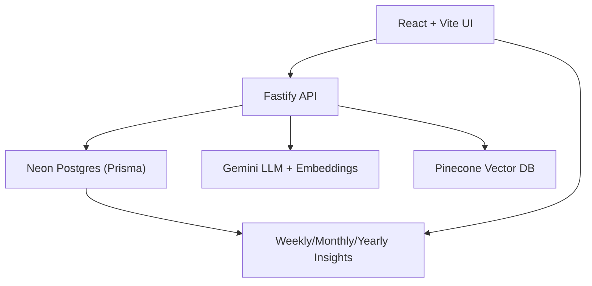

# DreamSync

DreamSync is a personal dream intelligence system. It helps you capture dreams privately, reflect with calm AI assistance, and build long‑term memory of themes, emotions, and symbols over time. It is intentionally **not** a social network or diagnostic tool.

## Why DreamSync Is Not a CRUD App
DreamSync is designed around lived experience, not records. Dreams are saved first and interpreted asynchronously, reflections are user‑written, and insights are generated as calm letters rather than dashboards. The system is resilient even when AI fails.

## Core Vision
- Private dream journaling, always available
- Reflective interpretation with non‑diagnostic language
- Long‑term semantic memory and trend detection
- Calm, psychology‑aware UX
- AI as augmentation, not dependency

## Architecture (High Level)
- **Frontend**: Vite + React + TypeScript + Tailwind + React Router + Zustand
- **Backend**: Fastify + Prisma + Neon PostgreSQL
- **AI**: Google Gemini (interpretation + embeddings), Pinecone (vector memory)



## Key Flows
1. **Dream Save**: Persist to Postgres immediately.
2. **Interpretation**: Async generation with safety validation and fallback.
3. **Reflections**: User‑written answers to AI prompts (first‑class data).
4. **Insights**: Weekly/Monthly letters + deterministic yearly arc.

## Privacy & Anonymity
- Dreams are private by default.
- Community sharing is optional and anonymous.
- No likes, comments, or engagement mechanics.
- No diagnosis, predictions, or authority claims.

## Screenshots
- `docs/screenshots/login.png`
- `docs/screenshots/journal.png`
- `docs/screenshots/insights.png`

## Local Development
Frontend:
```bash
cd dreamsync-frontend
npm install
npm run dev
```

Backend:
```bash
cd dreamsync-backend
npm install
npm run dev
```

Ensure `.env` is configured for:
- `JWT_SECRET`
- `DATABASE_URL`
- `GEMINI_API_KEY`
- `PINECONE_API_KEY`

## Status
Post‑MVP polishing underway: community UX polish, full‑screen insight reading, yearly arc, and documentation.
