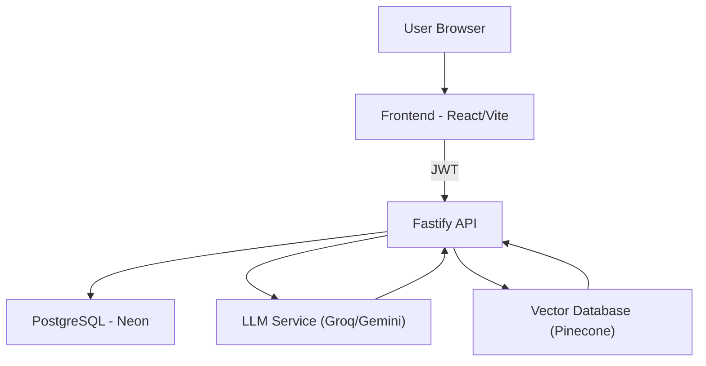

# DreamSync

DreamSync is a personal dream intelligence system designed for private reflection and long-term emotional insight. It helps users capture dreams, reflect with calm AI assistance, and build a meaningful memory of themes, emotions, and symbols over time.

DreamSync is intentionally not a social network, productivity tool, or diagnostic system.

## Why DreamSync Is Not a CRUD App
DreamSync is built around lived experience, not records.
- **Async Processing**: Dreams are stored immediately and interpreted asynchronously.
- **User Agency**: Reflections are written by the user, not AI-generated.
- **Narrative UX**: Insights are delivered as calm narrative letters, not analytics dashboards.
- **Robustness**: The system remains usable and meaningful even when AI services are unavailable.

This architecture prioritizes continuity, safety, and trust over automation.

## Core Vision
- Private dream journaling, always available
- Reflective interpretation with non‑diagnostic language
- Long‑term semantic memory and trend detection
- Calm, psychology‑aware UX
- AI as augmentation, not dependency

## Architecture (High Level)
- **Frontend**: Vite + React + TypeScript + Tailwind + React Router + Zustand
- **Backend**: Node.js + Fastify + Prisma + Neon PostgreSQL
- **AI**: Groq (Primary) / Gemini 2.0 (Fallback) + Pinecone (Vector Memory)


```mermaid
graph TD
    A[User Browser] --> B[Frontend - React/Vite]
    B -->|JWT| C[Fastify API]
    C --> D[PostgreSQL - Neon]
    C --> E["LLM Service (Groq/Gemini)"]
    C --> F["Vector Database (Pinecone)"]
    E --> C
    F --> C
```

---

## Key Features
- **Secure Auth**: JWT-based authentication for private access.
- **Private Journaling**: Simple, focused interface for capturing dreams.
- **AI interpretation**: Groq/Gemini powered insights with focus on psychology.
- **Reflections**: Dedicated space for user-driven emotional processing.
- **Insight Letters**: Weekly / monthly / yearly analysis delivered as narrative letters.
- **Semantic Memory**: Pattern detection using vector embeddings to find connections over years.

---

## Tech Stack

### Frontend
- React 19
- Vite
- TypeScript
- Tailwind CSS
- Framer Motion (Animations)

### Backend
- Node.js (CommonJS)
- Fastify
- Prisma ORM
- Zod (Validation)

### Data & AI
- **Database**: Neon PostgreSQL
- **LLM**: GroqCloud (llama-3.3-70b) / Google Gemini 2.0 Flash (Fallback)
- **Vector Search**: Pinecone

---

## Deployment

### Frontend (Vercel)
- Configured with `VITE_API_BASE_URL` pointing to the backend.
- Handled built-time vs runtime environment isolation.

### Backend (Render/Railway)
- Fastify server running on `0.0.0.0` for production port binding.
- Database connection pooling for Neon compatibility.
- Standardized CORS handling for production domains.

---

## Local Development

### Prerequisites
- Node.js 18+
- PostgreSQL (or Neon DB)
- API keys for Groq/Gemini and Pinecone

### Backend Setup
```bash
cd dreamsync-backend
npm install
# Run Prisma migrations
npx prisma generate
npx prisma db push
# Start dev server (Port 4000)
npm run dev
```

**Backend `.env` Requirements:**
```env
DATABASE_URL="postgresql://..."
DIRECT_URL="postgresql://..."
JWT_SECRET="your-secret"
GROQ_API_KEY="gsk_..."
GEMINI_API_KEY="AIza..."
PINECONE_API_KEY="..."
```

### Frontend Setup
```bash
cd dreamsync-frontend
npm install
# Start dev server (Port 5173)
npm run dev
```

**Frontend `.env` Requirements:**
```env
VITE_API_URL="http://localhost:4000"
```

---

## Project Status

### ✅ Completed
- Secure JWT Authentication
- Dream journaling and storage
- Async AI interpretation (Groq + Gemini fallback)
- Emotional pattern detection and reflections
- Production-grade deployment configuration

### 🚧 In Progress
- UI polish and micro-animations (Framer Motion)
- Community feature refinement (Privacy-aware)
- Full-screen insight reading experience
- Yearly emotional arc finalization

---

## Author

**Shivani**  
Full-stack developer focused on thoughtful product design, production systems, and responsible AI-assisted applications.
