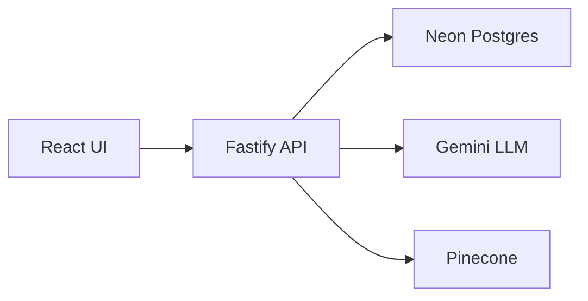

# DreamSync Architecture

DreamSync is built for reflection, not engagement. The system is intentionally calm, resilient, and privacy‑first.

## System Overview

## Data Flow
- Dreams are saved first (never blocked by AI).
- Interpretations are generated asynchronously and validated for safety.
- Reflections are user‑written and stored as primary data.
- Insights are precomputed and cached to avoid recomputation.

## Modules
- **auth**: JWT authentication
- **dreams**: CRUD + ownership
- **interpretation**: async LLM + fallback
- **reflections**: user responses to prompts
- **stats/insights**: deterministic analytics + letters
- **community**: optional anonymous sharing

## Principles
- No diagnosis or prediction
- Calm language, user agency
- Anonymity preserved
- Deterministic logic where possible
